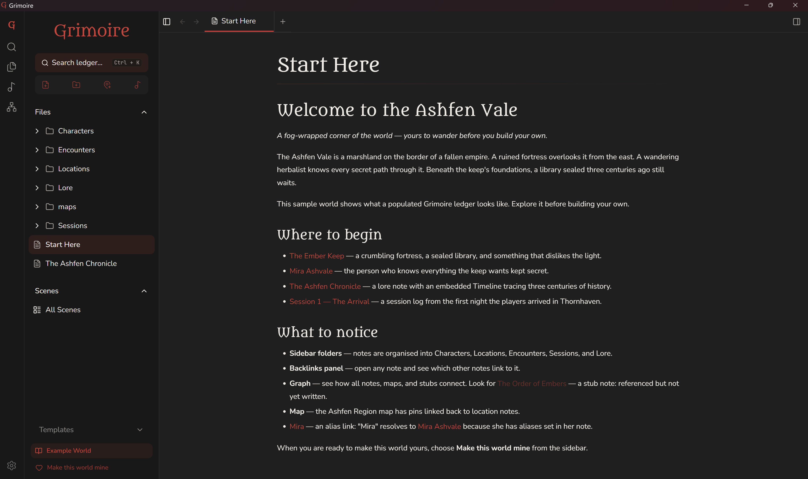

<h1 align="center">📜 Grimoire</h1>

  <strong>A spellbook of record for tabletop RPG worldbuilders.</strong>

  
  
  

<!-- Replace with a real screenshot or GIF (recommended ~1200px wide). -->

  

Grimoire is a local-first desktop app for Game Masters to manage lore, NPCs,
maps, and session prep — a focused creative instrument for the world you're
building.

> **Prerelease** (`0.X.Y`). Local-first and stable at the core; iterating fast.

## Features

- **📁 Local-first ledgers** — your campaign is a portable local folder; move it anywhere without breaking links.
- **✍️ Markdown notes** — distraction-free editor; notes are plain `.md` files, never locked in.
- **🔊 Ambient audio scenes** — layer local audio and Spotify tracks into custom soundscapes.
- **🗺️ Interactive maps** — annotate world maps with pins and categories.
- **🎨 Arcane clarity** — a warm, parchment-and-ink interface tuned for clarity under pressure.

## Install

Download the latest build for your OS from the
[**Releases**](https://github.com/Larront/grimoire/releases) page:

| OS      | Installer                     |
| :------ | :---------------------------- |
| Windows | `.msi` or `.exe`              |
| macOS   | `.dmg` → drag to Applications |
| Linux   | `.deb` or `.AppImage`         |

> Builds are currently **unsigned** — your OS may warn about an unidentified
> developer on first launch (macOS: right-click → Open; Windows: More info → Run
> anyway).

On first launch you'll pick a folder to use as your **Ledger**; Grimoire stores
its campaign database in a hidden `.grimoire` folder inside it.

## Documentation

- **[CONTRIBUTING.md](CONTRIBUTING.md)** — setup, conventions, workflow, releases
- **[`docs/adr/`](docs/adr/)** — architecture decision records
- **[`docs/agents/`](docs/agents/)** — architecture, domain model, and Git workflow

## Tech stack

Tauri 2 · Svelte 5 (runes) · SvelteKit · SQLite (Diesel) · Tantivy · Tailwind CSS 4 · shadcn-svelte

## Reporting bugs

Grimoire writes a log file you can attach to a
[bug report](https://github.com/Larront/grimoire/issues):

| OS      | Log location                                          |
| :------ | :---------------------------------------------------- |
| Windows | `%LOCALAPPDATA%\com.lamonta.grimoire\logs\grimoire.log` |
| macOS   | `~/Library/Logs/com.lamonta.grimoire/grimoire.log`     |
| Linux   | `~/.local/share/com.lamonta.grimoire/logs/grimoire.log` |

## Contributing

Contributions are welcome — see **[CONTRIBUTING.md](CONTRIBUTING.md)** to get started.

## License

[GNU General Public License v3.0](LICENSE) © Aaron Lamont

## Credits

The sample world ships with the following audio:

- **"Final Battle of the Dark Wizards"** and **"Folk Round"** — Kevin MacLeod (incompetech.com), licensed under [Creative Commons: By Attribution 4.0](http://creativecommons.org/licenses/by/4.0/)
- **"Heavy Rain With Thunder"** and **"Crowd Walla"** — released under [CC0](https://creativecommons.org/publicdomain/zero/1.0/) (no attribution required)
